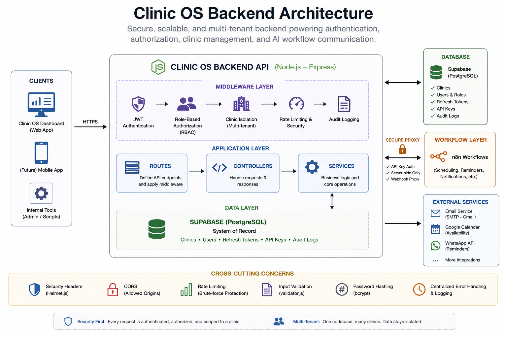

# Clinic OS Backend API

Production-grade Node.js/Express API powering authentication, authorization, multi-tenant clinic management, and secure AI-workflow communication for Clinic OS.

---

## Overview

Clinic OS Backend is the control layer that sits between the Clinic OS dashboard and the AI workflow layer (n8n). While the conversational AI handles patient-facing scheduling logic, this backend handles everything the AI layer should never be trusted with directly: who is logged in, what they're allowed to do, which clinic's data they can see, and a verifiable record of every sensitive action taken in the system.

Concretely, it provides:

- **Authentication** — JWT-based session handling with refresh token rotation, so staff stay logged in safely without re-entering credentials on every request.
- **Authorization (RBAC)** — a four-tier role system (super admin, admin, doctor, receptionist) that determines what each user can see and do.
- **Multi-tenant isolation** — every clinic's data is scoped so one clinic can never see another's appointments, users, or settings, even though they share the same database and API.
- **API endpoints** — the full set of routes the dashboard and internal tooling call for clinic, user, and key management.
- **Audit logging** — a persistent record of sensitive actions (logins, role changes, key generation, cancellations) for accountability and debugging.
- **Secure n8n proxy** — a layer that lets the dashboard trigger booking workflows without ever exposing n8n's internal webhook URLs or credentials to the frontend.

This backend doesn't make scheduling decisions — that's the AI/workflow layer's job. Its responsibility is to guard access, enforce boundaries between tenants, and provide a trustworthy data and audit layer underneath the rest of Clinic OS.

---

## Key Features

- JWT authentication with 12-hour token expiry
- Refresh token rotation supporting 7–30 day sessions
- Role-based access control across four staff roles
- Per-clinic data isolation enforced at the middleware level
- Audit logging for all sensitive actions
- Account lockout after 5 failed login attempts
- Rate limiting on login and booking endpoints
- API key management for n8n webhook authentication
- Centralized error handling and structured JSON responses
- Health check endpoint for deployment monitoring

---

## System Architecture

Clinic OS Backend is the middle layer in the overall Clinic OS system: the dashboard (frontend) never talks to n8n directly, and n8n never holds its own user accounts or permission logic. Every request from the dashboard is authenticated and authorized here first, and every call out to the workflow layer is proxied through this backend so that webhook URLs and API keys stay server-side.



---

## Request Lifecycle

1. Dashboard sends authenticated request
2. JWT middleware validates user
3. RBAC verifies permissions
4. Clinic middleware scopes data
5. Controller receives request
6. Service executes business logic
7. Supabase updates records
8. Response returned to dashboard
9. Audit middleware records sensitive actions

---

## Backend Architecture

The codebase follows a standard layered Express architecture, with each layer owning a single responsibility:

- **Express application** (`src/index.js`) — wires together security middleware, mounts routes, and starts the server. This is the only file that knows about the full request lifecycle.
- **Controllers** — handle incoming HTTP requests and responses. They translate HTTP into calls on the service layer and translate service results back into JSON responses. No business logic lives here.
- **Services** — contain the actual business logic: authentication flows, user management, email sending, and the n8n proxy logic. Controllers stay thin by delegating to services.
- **Middleware** — cross-cutting concerns that run before requests reach a controller: JWT verification, role checks, clinic-scoping, and audit logging.
- **Routes** — declare the API surface and which middleware applies to each route.
- **Utilities** — shared helpers for input validation and consistent response formatting.
- **Supabase** — the system of record. Postgres tables for clinics, users, refresh tokens, API keys, and audit logs, accessed through a thin config wrapper rather than scattered client calls.
- **n8n Proxy** — a dedicated controller/service pair that forwards authenticated requests (slot lookup, booking, rescheduling) to n8n webhooks, so the AI workflow layer never has to handle authentication itself.

---

## Authentication & Authorization

**JWT** access tokens are short-lived (12 hours) and used to authenticate every protected request. Keeping them short-lived limits the damage if a token is ever leaked.

**Refresh tokens** are longer-lived (7–30 days) and stored hashed in the database, with rotation on each use. This lets staff stay logged in across sessions without keeping a long-lived token in the browser that would be a bigger liability if compromised.

**RBAC** is enforced through the `role` middleware, which checks a user's role against what an endpoint requires before the request reaches a controller. The four roles — super admin, admin, doctor, receptionist — map directly to real clinic job functions, so permissions read naturally rather than as an abstract permission matrix.

**Clinic isolation** is enforced through the `clinic` middleware, which scopes every database query to the requesting user's `clinic_id`. This is what makes the system safely multi-tenant: the same codebase and database serve every clinic, but no clinic can query another's data.

---

## Folder Structure

```
src/
├── config/         → App configuration (Supabase, CORS, rate limiting)
├── controllers/    → Handle HTTP requests/responses
├── middleware/     → Auth, role, clinic isolation, audit logging
├── routes/         → API endpoint definitions
├── services/       → Business logic
└── utils/          → Validators, response helpers
```

---

## API Overview

### Authentication (Public)
```
POST /api/auth/login            → Login
POST /api/auth/refresh          → Refresh JWT token
POST /api/auth/logout           → Logout (requires token)
POST /api/auth/forgot-password  → Request reset email
POST /api/auth/reset-password   → Reset with token
GET  /api/auth/me               → Get current user
```

### Users (Admin only)
```
GET    /api/users             → List clinic users
POST   /api/users             → Create user
PUT    /api/users/:id         → Update user
PUT    /api/users/:id/disable → Disable account
PUT    /api/users/:id/enable  → Enable account
```

### Clinic (Authenticated)
```
GET  /api/clinic            → Get clinic info
PUT  /api/clinic/settings   → Update settings (admin)
```

### API Keys (Admin only)
```
GET    /api/keys            → List API keys
POST   /api/keys            → Generate new key
DELETE /api/keys/:id        → Revoke key
```

### n8n Proxy (Authenticated)
```
GET  /api/proxy/slots       → Get available slots
POST /api/proxy/book        → Book appointment
POST /api/proxy/find        → Find appointment
POST /api/proxy/reschedule  → Reschedule appointment
```

### Audit Logs (Admin only)
```
GET /api/audit              → View audit logs
```

---

## Roles & Permissions

| Action | Super Admin | Admin | Doctor | Receptionist |
|---|---|---|---|---|
| View appointments | ✅ | ✅ | ✅ | ✅ |
| Mark attendance | ✅ | ✅ | ✅ | ✅ |
| Cancel/reschedule | ✅ | ✅ | ❌ | ✅ |
| Manage users | ✅ | ✅ | ❌ | ❌ |
| View audit logs | ✅ | ✅ | ❌ | ❌ |
| Manage API keys | ✅ | ✅ | ❌ | ❌ |
| Manage all clinics | ✅ | ❌ | ❌ | ❌ |

---

## Security Features

- **JWT authentication** with 12-hour expiry
- **Refresh token rotation** (7–30 day sessions)
- **Account lockout** after 5 failed login attempts
- **Rate limiting** on login and booking endpoints
- **CORS** restricted to allowed domains
- **Helmet.js** security headers
- **Multi-clinic isolation** — users only see their own clinic's data
- **Audit logging** for all sensitive actions
- **Password hashing** with bcrypt (salt rounds: 12)
- **Input validation** on all endpoints

---

## Tech Stack

| Layer | Technology |
|---|---|
| Runtime | Node.js 18+ |
| Framework | Express.js |
| Database | Supabase (PostgreSQL) |
| Auth | JWT + Refresh Tokens |
| Security | Helmet, CORS, bcryptjs, express-rate-limit |
| Email | Nodemailer (Gmail SMTP) |
| Validation | validator.js |

---

## Local Development

### Step 1 — Clone & Install

```bash
cd clinic-os-backend
npm install
```

### Step 2 — Set Up Supabase

1. Go to [supabase.com](https://supabase.com)
2. Create new project: `clinic-os-backend`
3. Go to **SQL Editor** → **New Query**
4. Paste contents of `supabase_schema.sql` and click **Run**
5. Go to **Settings → API**
6. Copy your **Project URL** and **Service Role Key**

### Step 3 — Environment Variables

```bash
cp .env.example .env
```

Fill in your `.env` file:
- `SUPABASE_URL` → from Supabase settings
- `SUPABASE_SERVICE_KEY` → from Supabase settings
- `JWT_SECRET` → generate with: `node -e "console.log(require('crypto').randomBytes(64).toString('hex'))"`
- `REFRESH_TOKEN_SECRET` → generate the same way
- `SMTP_USER` → your Gmail address
- `SMTP_PASS` → Gmail App Password (not your regular password)

### Step 4 — Run Locally

```bash
npm run dev
```

Server starts at: `http://localhost:3000`

### Step 5 — Test Health Check

```bash
curl http://localhost:3000/health
```

Should return: `{"success": true, "message": "Smile Dental API is running"}`

---

## Deployment

1. Push code to GitHub
2. Go to [railway.app](https://railway.app)
3. New Project → Deploy from GitHub
4. Select your repo
5. Add environment variables (copy from `.env`)
6. Deploy

Railway will give you a URL like: `https://clinic-os-backend.railway.app`

---

## Engineering Decisions

**JWT Authentication.** Stateless tokens mean the API doesn't need a session store to verify identity on every request — important for a backend designed to be horizontally simple to deploy on Railway. A 12-hour expiry was chosen to keep the blast radius of a leaked token small without forcing staff to re-authenticate constantly during a workday.

**Refresh Token Rotation.** A short-lived access token alone would force frequent re-logins; a long-lived access token alone would be a much bigger risk if leaked. Refresh tokens solve this by letting the access token stay short-lived while the refresh token — stored hashed, rotated on each use — handles long-term session continuity. Rotation specifically means a stolen refresh token has a narrow window of usefulness.

**Supabase.** Clinic OS needed a relational database with strong constraints (foreign keys, check constraints) to enforce data integrity around roles, clinic ownership, and token lifecycles — not a flexible schema-less store. Supabase gave that Postgres foundation along with a managed API surface, without taking on the operational overhead of running Postgres directly.

**Multi-tenant Architecture.** Running one codebase and one database across multiple clinics, rather than spinning up isolated infrastructure per clinic, keeps the system maintainable as more clinics onboard. The tradeoff is that isolation has to be enforced correctly in code — which is why clinic-scoping lives in dedicated middleware rather than being repeated ad hoc inside individual controllers.

**n8n Proxy Layer.** The AI workflow layer needs to trigger bookings, lookups, and reschedules, but it shouldn't be the thing holding user sessions or deciding who's allowed to do what. Proxying those calls through this backend means n8n only ever receives requests that have already been authenticated and authorized, and the frontend never sees n8n's actual webhook URLs or keys.

**Audit Logging.** Clinic staff manage real patient appointments, and admins need a way to answer "who changed this and when" without digging through application logs. A dedicated audit table, written to by middleware rather than scattered logging calls, makes that answerable by a simple query instead of forensic log archaeology.

**Express.js.** The API surface here is straightforward CRUD plus a proxy layer — it doesn't need a heavier framework's opinions about structure. Express's minimalism made it easy to lay out the project in clear, single-responsibility layers (controllers/services/middleware) without fighting the framework's conventions.

---

## Lessons Learned

Building this backend made it clear that most of the hard problems in a "simple" CRUD API aren't the CRUD part — they're the boundaries around it. Getting authentication right is mechanical; getting multi-tenant isolation right means thinking carefully about every query that touches clinic-scoped data and making sure there's no path that skips the check. Getting audit logging right means deciding upfront what "sensitive" means, rather than bolting it on after an incident.

The broader lesson was about where this backend sits relative to the AI layer in Clinic OS: an AI system that's connected to real bookings and real patient data is only as trustworthy as the access control underneath it. The model's job is to understand a conversation and decide what should happen next — but deciding *who's allowed to ask for that* and *whether the request is even seeing the right clinic's data* has to be enforced by deterministic, testable code, not inferred by the AI. That separation is what makes the system safe to put in front of real clinics.

---

## Connect

If you're interested in Applied AI, workflow automation, or building operational AI systems, I'd be happy to connect.

* 💼 **LinkedIn:** https://linkedin.com/in/dhruva-reddy-gaddam
* 💻 **GitHub:** https://github.com/GDR-26
* 🌐 **Portfolio:** *Coming Soon*
